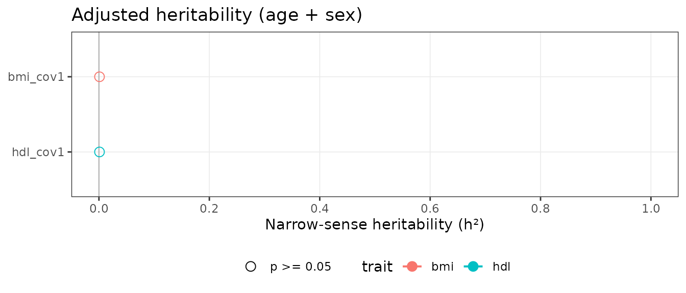

# Getting started with itable

``` r

library(itable)
```

## Overview

**itable** estimates narrow-sense heritability (h²) for quantitative
traits in family cohort studies using a profile-likelihood
variance-components approach, without requiring SOLAR Eclipse or any
proprietary software.

The three main steps are:

1.  Build the additive genetic relationship matrix (GRM) from a
    pedigree.
2.  Estimate heritability for one trait with
    [`herit_vc()`](https://r-itable.circadia-lab.uk/reference/herit_vc.md).
3.  Scale to many traits with
    [`herit_batch()`](https://r-itable.circadia-lab.uk/reference/herit_batch.md),
    then visualise with
    [`plot_forest()`](https://r-itable.circadia-lab.uk/reference/plot_forest.md).

------------------------------------------------------------------------

## 1. Build the GRM

Your pedigree data frame needs four columns: individual ID, father ID,
mother ID, and sex (1 = male, 2 = female). Missing parents are coded
`NA` or `0`.

``` r

# Minimal example pedigree (founders + one generation of offspring)
ped <- data.frame(
  id  = 1:8,
  pat = c(0, 0, 0, 0, 1, 1, 3, 3),
  mom = c(0, 0, 0, 0, 2, 2, 4, 4),
  sex = c(1, 2, 1, 2, 1, 2, 1, 2)
)

# Study subjects are the offspring (IDs 5–8)
A <- build_grm(ped, study_ids = 5:8)
round(A, 3)
#>     5   6   7   8
#> 5 1.0 0.5 0.0 0.0
#> 6 0.5 1.0 0.0 0.0
#> 7 0.0 0.0 1.0 0.5
#> 8 0.0 0.0 0.5 1.0
```

The diagonal is 1 for non-inbred individuals. Full siblings share 0.5 of
their genetic material on average, so off-diagonal entries for sibling
pairs ≈ 0.5.

------------------------------------------------------------------------

## 2. Estimate heritability for a single trait

``` r

set.seed(42)

# Simulate some phenotype data for the study subjects
dat <- data.frame(
  IID     = 5:8,
  age     = c(35, 38, 40, 44),
  sex_num = c(1, 2, 1, 2),
  bmi     = c(24.1, 27.3, 22.8, 29.5)
)

# Unadjusted model
res_unadj <- herit_vc("bmi", grm = A, data = dat, min_n = 3)
#> ✔ bmi_unadj  n=4  h2=0.001 [0,1]  p=0.5

# Adjusted model (age + sex)
res_adj <- herit_vc("bmi", grm = A, data = dat,
                    covs  = c("age", "sex_num"),
                    label = "bmi_adj",
                    min_n = 3)
#> ✔ bmi_adj  n=4  h2=0.001 [NA,NA]  p=0.5

str(res_unadj)
#> List of 11
#>  $ label     : chr "bmi_unadj"
#>  $ trait     : chr "bmi"
#>  $ covariates: chr ""
#>  $ n         : int 4
#>  $ h2        : num 0.001
#>  $ se        : num 44.7
#>  $ ci_lo     : num 0
#>  $ ci_hi     : num 1
#>  $ pval      : num 0.5
#>  $ sigma2_a  : num 0.00071
#>  $ sigma2_e  : num 0.712
```

The returned list contains:

| Field            | Description                                |
|------------------|--------------------------------------------|
| `h2`             | MLE narrow-sense heritability              |
| `se`             | SE from profile-LL curvature               |
| `ci_lo`, `ci_hi` | 95% profile-likelihood CI                  |
| `pval`           | One-sided LRT p-value (boundary-corrected) |
| `sigma2_a`       | Additive genetic variance                  |
| `sigma2_e`       | Residual variance                          |

------------------------------------------------------------------------

## 3. Batch estimation

For real analyses you will typically run many traits across several
covariate models.
[`herit_batch()`](https://r-itable.circadia-lab.uk/reference/herit_batch.md)
handles this and returns a tidy data frame.

``` r

# Add a second trait
dat$hdl <- c(55.0, 60.2, 48.3, 72.1)

covs_list <- list(
  unadj = NULL,
  cov1  = c("age", "sex_num")
)

res <- herit_batch(
  traits    = c("bmi", "hdl"),
  grm       = A,
  data      = dat,
  covs_list = covs_list,
  min_n     = 3,
  .progress = FALSE
)

res
#>       label trait  covariates n    h2      se ci_lo ci_hi pval sigma2_a
#> 1 bmi_unadj   bmi             4 0.001 44.7214     0     1  0.5  0.00071
#> 2 hdl_unadj   hdl             4 0.001 44.7214     0     1  0.5  0.00071
#> 3  bmi_cov1   bmi age+sex_num 4 0.001      NA    NA    NA  0.5  0.00017
#> 4  hdl_cov1   hdl age+sex_num 4 0.001      NA    NA    NA  0.5  0.00017
#>   sigma2_e
#> 1  0.71206
#> 2  0.71206
#> 3  0.17143
#> 4  0.17143
```

------------------------------------------------------------------------

## 4. Forest plot

``` r

if (requireNamespace("ggplot2", quietly = TRUE)) {
  plot_forest(res,
              model_filter  = "cov1",
              colour_by     = "trait",
              title         = "Adjusted heritability (age + sex)")
}
```



------------------------------------------------------------------------

## 5. Real-study workflow

A typical family cohort workflow looks like this:

``` r

library(itable)

# 1. Load pedigree (full pedigree including founders)
ped <- read.csv("baependi_pedigree_full.csv")

# 2. Load analysis dataset
dat <- read.csv("baependi_analysis_dataset.csv")
dat$age2    <- dat$age^2
dat$age_sex <- dat$age * dat$sex_num

# 3. Build GRM once — reuse for all traits
A <- build_grm(ped,
               study_ids = dat$IID,
               id_col    = "IID",
               pat_col   = "pat",
               mom_col   = "mat",
               sex_col   = "sex_num")

# 4. Define covariate models
covs_list <- list(
  unadj = NULL,
  cov1  = c("age", "sex_num"),
  cov2  = c("age", "sex_num", "age2"),
  cov3  = c("age", "sex_num", "age2", "age_sex")
)

# 5. Run batch estimation
brain_traits <- c("k", "S", "I", "AvgThickness", "localGI_corrected")

res <- herit_batch(
  traits    = brain_traits,
  grm       = A,
  data      = dat,
  covs_list = covs_list
)

# 6. Save and plot
write.csv(res, "table_heritability_brain.csv", row.names = FALSE)
plot_forest(res, model_filter = "cov2",
            title = "Brain morphology heritability (age + sex + age²)")
```

------------------------------------------------------------------------

## Citation

If you use **itable** in a publication, please cite:

    Veras, L. (2026). itable: Pedigree-Based Heritability Estimation for Family
    Cohort Studies. R package version 0.1.0.
    https://github.com/circadia-bio/R-itable
