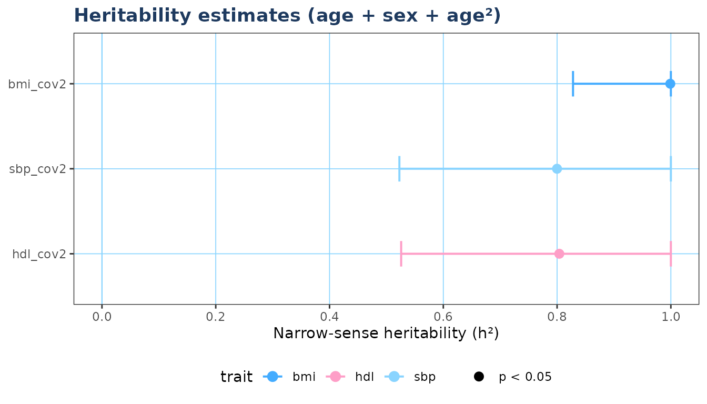

# Getting started with Ritable

``` r

library(Ritable)
```

## Overview

**Ritable** estimates narrow-sense heritability (h²) for quantitative
traits in family cohort studies using a profile-likelihood
variance-components approach, without requiring SOLAR Eclipse or any
proprietary software.

The three main steps are:

1.  Build the additive genetic relationship matrix (GRM) from a
    pedigree.
2.  Estimate heritability for one trait with
    [`herit_vc()`](https://r-itable.circadia-lab.uk/reference/herit_vc.md).
3.  Scale to many traits with
    [`herit_batch()`](https://r-itable.circadia-lab.uk/reference/herit_batch.md),
    then visualise with
    [`plot_forest()`](https://r-itable.circadia-lab.uk/reference/plot_forest.md).

------------------------------------------------------------------------

## 1. Build the GRM

Your pedigree data frame needs four columns: individual ID, father ID,
mother ID, and sex (1 = male, 2 = female). Missing parents are coded
`NA` or `0`.

``` r

# Minimal example pedigree (founders + one generation of offspring)
ped <- data.frame(
  id  = 1:8,
  pat = c(0, 0, 0, 0, 1, 1, 3, 3),
  mom = c(0, 0, 0, 0, 2, 2, 4, 4),
  sex = c(1, 2, 1, 2, 1, 2, 1, 2)
)

# Study subjects are the offspring (IDs 5-8)
A <- build_grm(ped, study_ids = 5:8)
round(A, 3)
#>     5   6   7   8
#> 5 1.0 0.5 0.0 0.0
#> 6 0.5 1.0 0.0 0.0
#> 7 0.0 0.0 1.0 0.5
#> 8 0.0 0.0 0.5 1.0
```

The diagonal is 1 for non-inbred individuals. Full siblings share 0.5 of
their genetic material on average, so off-diagonal entries for sibling
pairs are 0.5.

------------------------------------------------------------------------

## 2. Estimate heritability for a single trait

``` r

set.seed(42)

# Simulate some phenotype data for the study subjects
dat <- data.frame(
  IID     = 5:8,
  age     = c(35, 38, 40, 44),
  sex_num = c(1, 2, 1, 2),
  bmi     = c(24.1, 27.3, 22.8, 29.5)
)

# Unadjusted model
res_unadj <- herit_vc("bmi", grm = A, data = dat, min_n = 3)
#> ✔ bmi_unadj  n=4  h2=0.001 [0,1]  p=0.5

# Adjusted model (age + sex)
res_adj <- herit_vc("bmi", grm = A, data = dat,
                    covs  = c("age", "sex_num"),
                    label = "bmi_adj",
                    min_n = 3)
#> ✔ bmi_adj  n=4  h2=0.001 [NA,NA]  p=0.5

str(res_unadj)
#> List of 11
#>  $ label     : chr "bmi_unadj"
#>  $ trait     : chr "bmi"
#>  $ covariates: chr ""
#>  $ n         : int 4
#>  $ h2        : num 0.001
#>  $ se        : num 44.7
#>  $ ci_lo     : num 0
#>  $ ci_hi     : num 1
#>  $ pval      : num 0.5
#>  $ sigma2_a  : num 0.00071
#>  $ sigma2_e  : num 0.712
```

The returned list contains:

| Field            | Description                                |
|------------------|--------------------------------------------|
| `h2`             | MLE narrow-sense heritability              |
| `se`             | SE from profile-LL curvature               |
| `ci_lo`, `ci_hi` | 95% profile-likelihood CI                  |
| `pval`           | One-sided LRT p-value (boundary-corrected) |
| `sigma2_a`       | Additive genetic variance                  |
| `sigma2_e`       | Residual variance                          |

------------------------------------------------------------------------

## 3. Batch estimation

For real analyses you will typically run many traits across several
covariate models.
[`herit_batch()`](https://r-itable.circadia-lab.uk/reference/herit_batch.md)
handles this and returns a tidy data frame.

``` r

# Add a second trait
dat$hdl <- c(55.0, 60.2, 48.3, 72.1)

covs_list <- list(
  unadj = NULL,
  cov1  = c("age", "sex_num")
)

res <- herit_batch(
  traits    = c("bmi", "hdl"),
  grm       = A,
  data      = dat,
  covs_list = covs_list,
  min_n     = 3,
  .progress = FALSE
)

res
#>       label trait  covariates n    h2      se ci_lo ci_hi pval sigma2_a
#> 1 bmi_unadj   bmi             4 0.001 44.7214     0     1  0.5  0.00071
#> 2 hdl_unadj   hdl             4 0.001 44.7214     0     1  0.5  0.00071
#> 3  bmi_cov1   bmi age+sex_num 4 0.001      NA    NA    NA  0.5  0.00017
#> 4  hdl_cov1   hdl age+sex_num 4 0.001      NA    NA    NA  0.5  0.00017
#>   sigma2_e
#> 1  0.71206
#> 2  0.71206
#> 3  0.17143
#> 4  0.17143
```

------------------------------------------------------------------------

## 4. Forest plot

``` r

if (requireNamespace("ggplot2", quietly = TRUE)) {
  plot_forest(res,
              model_filter  = "cov1",
              colour_by     = "trait",
              title         = "Adjusted heritability (age + sex)")
}
```


------------------------------------------------------------------------

## 5. Realistic workflow

Here we simulate a small multi-family cohort — 80 nuclear families, 2
parents + 3 offspring each — with three phenotypes that have different
true h² values. This mirrors what you would do with real pedigree and
phenotype CSV files.

``` r

library(Ritable)

# ---- 1. Simulate pedigree ---------------------------------------------------
set.seed(2026)
n_fam <- 80

ped <- do.call(rbind, lapply(seq_len(n_fam), function(f) {
  base <- (f - 1L) * 5L
  data.frame(
    id  = base + 1:5,
    pat = c(0L, 0L, base + 1L, base + 1L, base + 1L),
    mom = c(0L, 0L, base + 2L, base + 2L, base + 2L),
    sex = c(1L, 2L, sample(1:2, 3, replace = TRUE))
  )
}))

# ---- 2. Simulate phenotypes for offspring -----------------------------------
# Three traits with approximate h2: bmi ~0.6, sbp ~0.35, hdl ~0.5
simulate_trait <- function(ped, n_fam, h2, seed) {
  set.seed(seed)
  genetic  <- rep(rnorm(n_fam, 0, sqrt(h2)),       each = 5)
  residual <- rnorm(nrow(ped),          0, sqrt(1 - h2))
  genetic + residual
}

pheno_all <- data.frame(
  bmi = simulate_trait(ped, n_fam, h2 = 0.60, seed = 1),
  sbp = simulate_trait(ped, n_fam, h2 = 0.35, seed = 2),
  hdl = simulate_trait(ped, n_fam, h2 = 0.50, seed = 3)
)

off_rows <- ped$pat != 0L
dat <- data.frame(
  IID     = ped$id[off_rows],
  age     = round(runif(sum(off_rows), 20, 75)),
  sex_num = ped$sex[off_rows],
  bmi     = pheno_all$bmi[off_rows],
  sbp     = pheno_all$sbp[off_rows],
  hdl     = pheno_all$hdl[off_rows]
)
dat$age2 <- dat$age^2

# ---- 3. Build GRM once — reuse for all models -------------------------------
A <- build_grm(ped, study_ids = dat$IID)

# ---- 4. Define covariate models ---------------------------------------------
covs_list <- list(
  unadj = NULL,
  cov1  = c("age", "sex_num"),
  cov2  = c("age", "sex_num", "age2")
)

# ---- 5. Batch estimation ----------------------------------------------------
res <- herit_batch(
  traits    = c("bmi", "sbp", "hdl"),
  grm       = A,
  data      = dat,
  covs_list = covs_list
)

res
#>       label trait       covariates   n     h2     se  ci_lo ci_hi pval sigma2_a
#> 1 bmi_unadj   bmi                  240 0.9990 0.1297 0.8400     1    0  0.93477
#> 2 sbp_unadj   sbp                  240 0.8055 0.1392 0.5303     1    0  0.80117
#> 3 hdl_unadj   hdl                  240 0.7998 0.1394 0.5243     1    0  0.79550
#> 4  bmi_cov1   bmi      age+sex_num 240 0.9990 0.1313 0.8331     1    0  0.92785
#> 5  sbp_cov1   sbp      age+sex_num 240 0.8012 0.1402 0.5240     1    0  0.79187
#> 6  hdl_cov1   hdl      age+sex_num 240 0.8014 0.1395 0.5258     1    0  0.79210
#> 7  bmi_cov2   bmi age+sex_num+age2 240 0.9990 0.1318 0.8280     1    0  0.92432
#> 8  sbp_cov2   sbp age+sex_num+age2 240 0.7999 0.1402 0.5228     1    0  0.78783
#> 9  hdl_cov2   hdl age+sex_num+age2 240 0.8039 0.1405 0.5259     1    0  0.79525
#>   sigma2_e
#> 1  0.00094
#> 2  0.19348
#> 3  0.19915
#> 4  0.00093
#> 5  0.19651
#> 6  0.19624
#> 7  0.00093
#> 8  0.19710
#> 9  0.19393
```

``` r

if (requireNamespace("ggplot2", quietly = TRUE)) {
  plot_forest(res, model_filter = "cov2",
              title = "Heritability estimates (age + sex + age\u00b2)")
}
```



------------------------------------------------------------------------

## Citation

If you use **Ritable** in a publication, please cite:

    Franca, L. & Leocadio-Miguel, M. (2026). Ritable: Pedigree-Based Heritability
    Estimation for Family Cohort Studies. R package version 0.1.0.
    https://github.com/circadia-bio/R-itable
